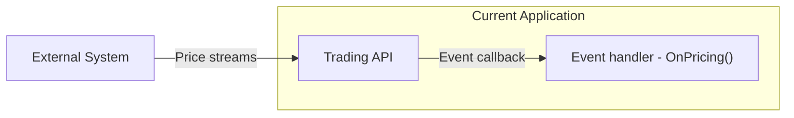

# Interview

## Welcome

Thank you for cloning this project! This project is designed to conduct a technical interview for C# developers. Good luck! 🤞

### How to Submit

You can submit your answers using one of the following methods:

1. Zip and send the code back to the HR contact.
2. Share the link to your forked project with HR.

---

## Background

### Pricing System Overview

You are **provided** (no need to implement) a .NET Standard library that simulates a pricing system. The API mimics receiving prices from external services.

Here is a high-level diagram:



The library includes a class named `TradingApi` which implements the following interface:

```csharp
public interface ITradingApi
{
    /// <summary>
    /// Get the full list of symbol definitions. Only two symbols are supported: "AUDUSD" and "CL-OIL".
    /// </summary>
    /// <returns>Symbols</returns>
    IEnumerable<Symbol> GetSymbols();

    /// <summary>
    /// If there is an incoming price and the symbol of the price is subscribed by SubscribeSymbol, 
    /// an event will fire, passing the pricing data as event data.
    /// </summary>
    event EventHandler<Price> OnPricing;

    /// <summary>
    /// Subscribe to a symbol to receive prices through the OnPricing event handler.
    /// </summary>
    /// <param name="symbolName">Name of a symbol</param>
    void SubscribeSymbol(string symbolName);
}
```

### Supporting Data Structures

```csharp
public struct Price
{
    public string Symbol { get; }
    public decimal Bid { get; }
    public decimal Ask { get; }
    public DateTime Time { get; }
}

public class Symbol
{
    public string Name { get; set; }
    public string BaseCurrency { get; set; }
    public int Digits { get; set; }
}

public class PriceStats
{
    public decimal Open { get; set; }
    public decimal Close { get; set; }
    public decimal Min { get; set; }
    public decimal Max { get; set; }
}
```

### Extension Method for Time Rounding

You can use the following extension method to round down a `DateTime` to a specific interval:

```csharp
public static DateTime RoundDown(this DateTime dateTime, TimeSpan interval)
{
    var delta = dateTime.Ticks % interval.Ticks;
    return new DateTime(dateTime.Ticks - delta, dateTime.Kind);
}
```

**Example Usage:**

```csharp
DateTime now = DateTime.UtcNow;
TimeSpan interval = TimeSpan.FromMinutes(1);
DateTime roundedTime = now.RoundDown(interval);

Console.WriteLine($"Original: {now}");
Console.WriteLine($"Rounded: {roundedTime}");
```

**Example Output:**
```
Original: 2025-01-23 15:12:45
Rounded: 2025-01-23 15:12:00
```

Use this method to group prices into minute intervals for calculating the `PriceStats`.

---

## Tasks

Your task is to complete the **controllers and services** to fulfill the following requirements. The skeleton for the controllers and services is already provided in the project.

### API Endpoints

1. **GET /api/symbols**  
   - Return a list of all available symbols.

2. **GET /api/symbols/{name}**  
   - Return a single `Symbol` object corresponding to the specified `{name}`.

3. **GET /api/price/{symbol}**  
   - Return the latest `Price` for the specified `{symbol}`.

4. **GET /api/price/{symbol}/stats**  
   - Return `PriceStats` containing the following details for the **current minute** (i.e., from the start of the current minute to now) for the specified `{symbol}`:
     - **Open**: The first `Bid` price in the minute.
     - **Close**: The last `Bid` price in the minute.
     - **Low**: The lowest `Bid` price in the minute.
     - **High**: The highest `Bid` price in the minute.

   **Hint:** Use the extension method above to round timestamps to the nearest minute and filter prices.

---

## Additional Notes
- You have full control over the project but **do not modify the provided mock service or its interface.**
- The mocked service provides live data when the project is built and run. **The data updates every second, simulating real-time market conditions.**
- Focus on code quality, performance, functionality, and solution design.
- The primary focus will be on your thought process and how you arrive at solutions.
- The estimated time to complete the tasks is **1 hour**.

Good luck! 🚀
