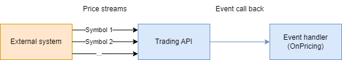

# Interview
## Welcome
Thanks for cloning this project. This project is mean for conducting a technical interview for C# developers.  
Good luck 🤞 

### How to submit
There are a few ways you can submit your answers:
1. Zip and send the code back to the contacting HR.
2. Just post your forked project link to HR.

## Backgrounds

### Pricing

You are provided a .net standard library that mock a pricing system.
The api simulated getting prices from external services.  
See the diagram below:  


The library has a class named “TradingApi” which implement interface:
``` c#
public interface ITradingApi
{
    /// <summary>
    /// Get full list of symbol definitions, only two symbols are supported: “AUDUSD” and “CL-OIL”.
    /// </summary>
    /// <returns>Symbols</returns>
    IEnumerable<Symbol> GetSymbols();
}
```
``` c#
public class Symbol
{
    public string Name { get; set; }
    public string BaseCurrency { get; set; }
    public int Digits { get; set; }
}
```

## Tasks
You tasks are to complete these **controllers and services** to full fill the following requirements. The controllers and services are already created created, 

### Symbol API
1.	GET /api/symbols
•	Return a list of all symbols

2.	GET /api/symbols/{name}
•	Return a single Symbol object with the {name}

3.  GET /api/symbols/search/{pattern}
•	Allow user to search for symbol names. return a list of symbols that **contains** the pattern